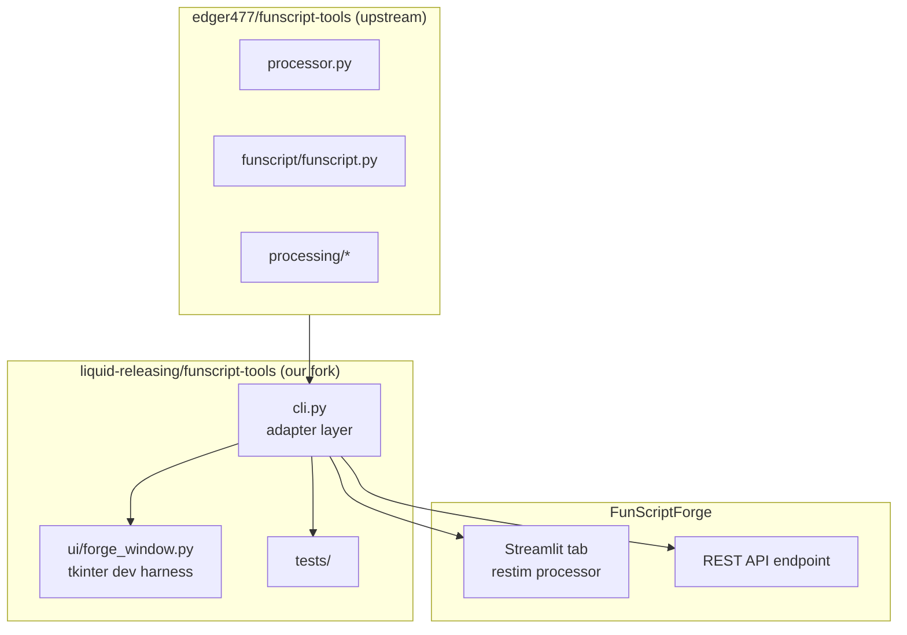
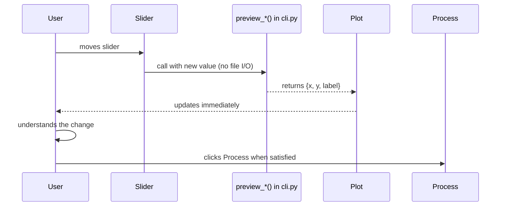
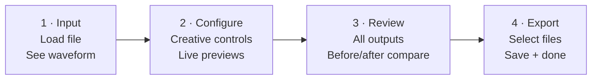
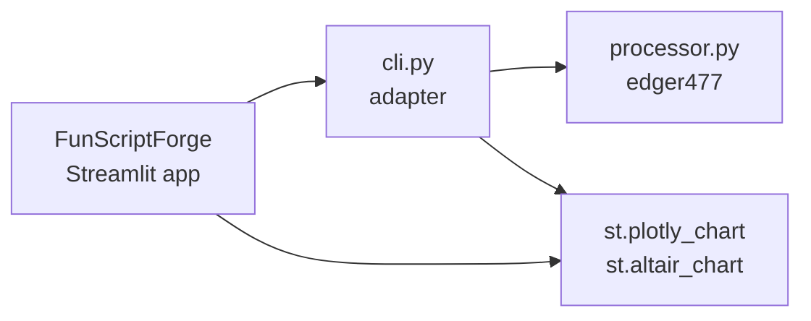

# Funscript Tools — Design Document

> Built on the processing engine by edger477:
> https://github.com/edger477/funscript-tools
>
> Our value-add: tests, CLI, API, docs, UI, visualizations, production packaging.
> All credit for the underlying algorithms belongs to edger477 and contributors.

---

## Architecture



`cli.py` is the **only** file that imports from upstream. Everything else
imports from `cli.py`. When upstream changes, only `cli.py` needs updating.

---

## Deployment targets

| Target | UI | How |
|--------|----|-----|
| Dev / test | tkinter (`forge_window.py`) | `python forge.py` |
| Desktop Win/Mac/Linux | Streamlit in FunScriptForge | PyInstaller |
| SaaS | Streamlit in FunScriptForge | Cloud deploy |
| Scripted / headless | CLI (`cli.py`) | `python cli.py process file.funscript` |
| Programmatic | Python API (`import cli`) | `from cli import process` |

---

## The cli.py contract

`cli.py` exposes two categories of functions:

### Processing functions
Full pipeline — reads files, writes output files.

```python
def load_file(path: str) -> dict:
    """
    Load a .funscript file.
    Returns: {
        name: str,
        path: str,
        actions: int,
        duration_s: float,
        duration_fmt: str,       # "MM:SS"
        pos_min: float,          # 0-100
        pos_max: float,
        x: list[float],          # time in seconds
        y: list[float],          # position 0-100
    }
    """

def get_default_config() -> dict:
    """Return the default processing configuration as a plain dict."""

def process(path: str, config: dict, on_progress=None) -> dict:
    """
    Run the full processing pipeline.
    on_progress: optional callback(percent: int, message: str)
    Returns: {
        success: bool,
        error: str | None,
        outputs: list[{ suffix: str, path: str, size_bytes: int }]
    }
    """

def list_outputs(directory: str, stem: str) -> list[dict]:
    """
    Find all generated output files for a given stem.
    Returns: list of { suffix: str, path: str, size_bytes: int }
    """
```

### Preview functions
Fast, **no file I/O** — pure numpy math. Safe to call on every slider move.

```python
def preview_electrode_path(
    algorithm: str,
    min_distance_from_center: float,
    points: int = 300
) -> dict:
    """
    Returns the 2D electrode path shape for the given algorithm.
    Uses a synthetic sinusoidal input so the shape is algorithm-dependent only.
    Returns: { x: list[float], y: list[float], label: str }
    """

def preview_frequency_blend(
    ramp_ratio: float,
    pulse_ratio: float
) -> dict:
    """
    Returns plain-language blend description.
    Returns: {
        ramp_pct: float,
        speed_pct: float,
        pulse_ramp_pct: float,
        pulse_alpha_pct: float,
        label: str              # "70% scene energy + 30% slow build"
    }
    """

def preview_pulse_shape(
    width_min: float,
    width_max: float,
    rise_min: float,
    rise_max: float
) -> dict:
    """
    Returns pulse silhouette data — a representative pulse waveform
    showing the effect of width and rise time settings.
    Returns: { x: list[float], y: list[float], label: str }
    """

def preview_output(
    source: dict,           # from load_file()
    config: dict,
    output_type: str        # e.g. "alpha", "frequency", "volume"
) -> dict:
    """
    Run a lightweight partial pipeline to preview a single output type.
    Faster than full process() — skips file I/O, returns array data.
    Returns: {
        original_x: list[float],
        original_y: list[float],
        output_x: list[float],
        output_y: list[float],
        label: str
    }
    """
```

---

## UI / Visualization principle

> Users know what they want to feel — not what the math means.
> Every parameter change should show its effect immediately.

### Parameter → visualization mapping

| Parameter | Visualization | Plain-language label |
|-----------|--------------|---------------------|
| Algorithm | 2D electrode path shape plot | "Circular arc", "Tear-drop", etc. |
| Min distance from center | Same path plot, radius changes live | "Tighter" ↔ "Wider range" |
| Ramp vs speed blend | Blend bar (two colored segments) | "70% scene energy + 30% slow build" |
| Pulse freq min/max | Frequency band diagram | "Pulses range from X to Y" |
| Pulse width/rise time | Pulse silhouette diagram | "Sharper" ↔ "Softer" |
| Before/after | Waveform overlay | Original (dim) + output (bright) |

### Visualization flow



---

## Workflow tabs



**Tab 2 layout — split pane:**

```
┌─────────────────────┬──────────────────────────────────┐
│  Creative Controls  │  Preview                         │
│                     │                                  │
│  [Algorithm ▼]      │  ┌──────────────────────────┐   │
│  [Min dist ──○──]   │  │ Electrode path shape      │   │
│  [Speed thresh ──]  │  │ (updates on slider move)  │   │
│                     │  └──────────────────────────┘   │
│  Frequency          │                                  │
│  [Ramp blend ──○──] │  ┌──────────────────────────┐   │
│  [Freq min ──○──]   │  │ Before vs After waveform  │   │
│  [Freq max ──○──]   │  │ (updates after Process)   │   │
│                     │  └──────────────────────────┘   │
│  Pulse shape        │                                  │
│  [Width ──○──○──]   │  Preview output: [alpha ▼]      │
│  [Rise  ──○──○──]   │                                  │
│                     │                                  │
│  [Full Config tab]  │                                  │
├─────────────────────┴──────────────────────────────────┤
│  ← Back                              Process →         │
└────────────────────────────────────────────────────────┘
```

---

## FunScriptForge integration

Once the standalone app is stable, the Streamlit tab calls the same `cli.py`:



The Streamlit tab replaces tkinter widgets with `st.` components, but calls
the identical `cli.py` preview and process functions.

---

## Value-add checklist (per OSS integration)

- [ ] `cli.py` — adapter layer, stable API
- [ ] Preview functions — parameter → visualization data
- [ ] Tests — `tests/test_cli.py` covering load, process, previews
- [ ] Plain-language labels — every parameter explained in user terms
- [ ] Docs — user guide page in MkDocs
- [ ] Streamlit tab — FunScriptForge production UI
- [ ] Cross-platform build verified (Win/Mac/Linux)
