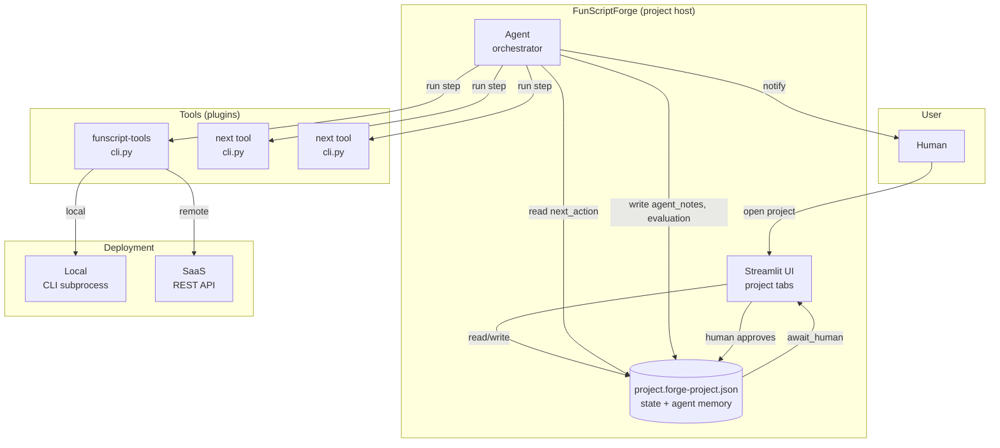
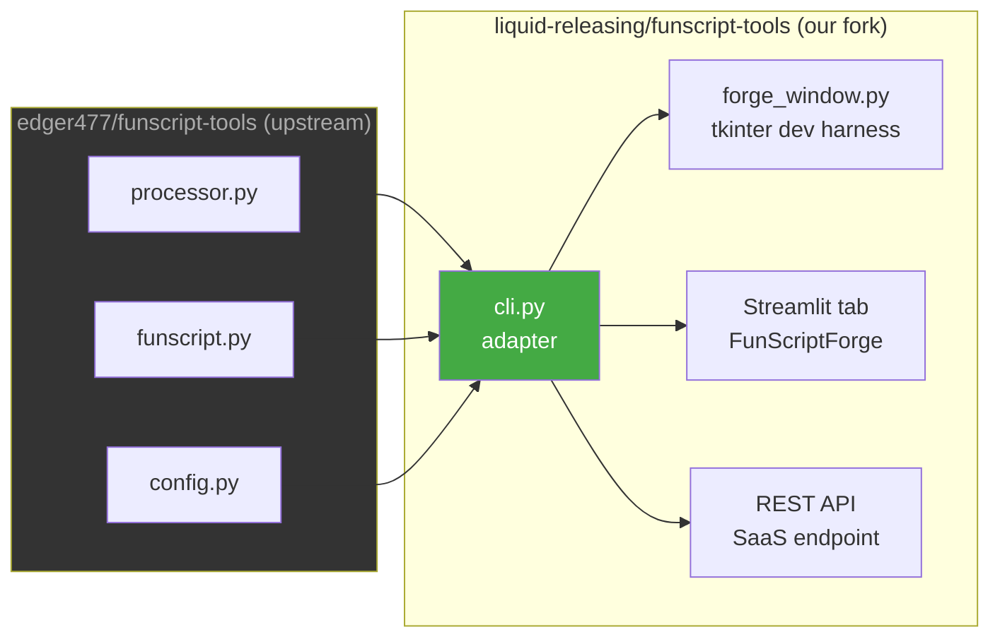
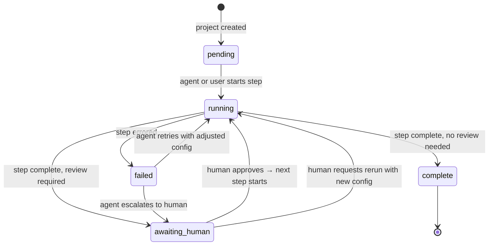
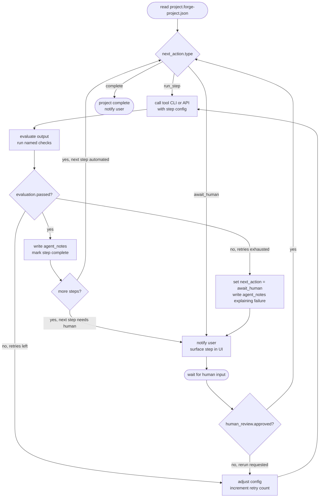
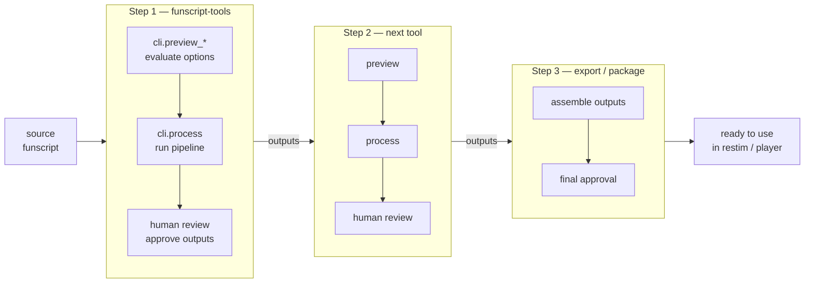
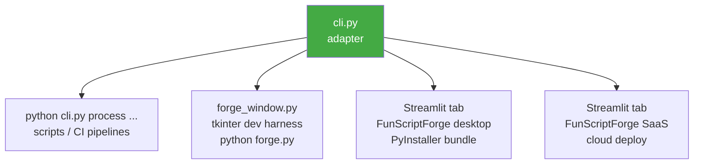

# Architecture Diagrams

---

## System overview



---

## OSS fork adapter pattern



`cli.py` is the only file that touches upstream internals.
When upstream changes, you fix `cli.py`. Everything else is untouched.

---

## Project state machine



---

## Agent loop



---

## Multi-step pipeline (future state)



Each step reads its inputs from the project file.
Outputs are written back to the project file before the next step starts.
A human approval gate can be placed after any step.
Long-running steps (video render, etc.) run async — the project file
holds `status: running` until they complete.

---

## Deployment targets



Same adapter. Same function signatures. Different rendering layer.
```
